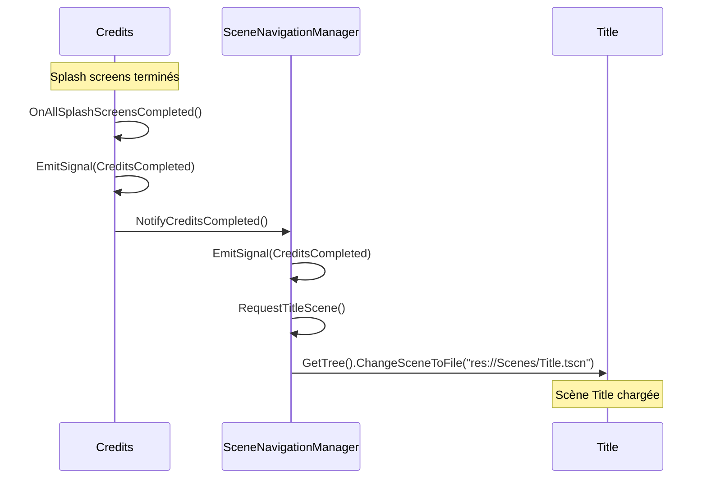
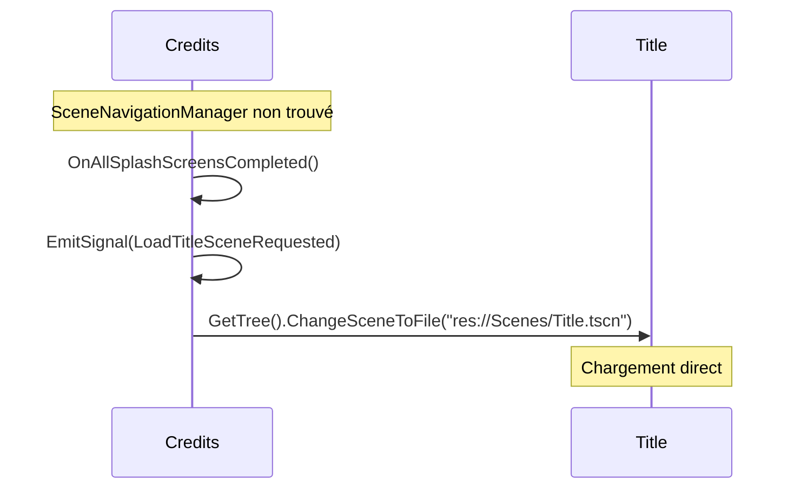

# ?? Système de Navigation par Signals - Credits ? Title

## ?? Overview

Implémentation d'un système de navigation par signals pour permettre aux crédits de demander le chargement de la scène Title via `MainGameScene`, avec un fallback utilisant `SceneNavigationManager` singleton.

## ?? Objectif

Au lieu que `Credits` change directement de scène vers `MainGameScene`, elle émet maintenant un signal pour demander le chargement de la scène `Title`, permettant une navigation plus contrôlée et modulaire.

## ??? Architecture Implémentée

### 1. **Credits.cs - Émetteur de Signals**
```csharp
#region Signals
[Signal]
public delegate void CreditsCompletedEventHandler();

[Signal]
public delegate void LoadTitleSceneRequestedEventHandler();
#endregion
```

### 2. **SceneNavigationManager.cs - Gestionnaire Singleton**
```csharp
public partial class SceneNavigationManager : Node
{
    public void NotifyCreditsCompleted()
    public void RequestTitleScene()
    public void LoadScene(string scenePath)
    // ... autres méthodes de navigation
}
```

### 3. **MainGameScene.cs - Récepteur (Fallback)**
```csharp
private void OnCreditsCompleted()
private void OnLoadTitleSceneRequested()
private void LoadTitleScene()
```

## ?? Flux de Navigation

### **Séquence Principale**


### **Séquence Fallback**


## ?? Modifications Détaillées

### 1. **Credits.cs - Nouveau système de signaling**

#### **Signaux ajoutés**
```csharp
[Signal]
public delegate void CreditsCompletedEventHandler();

[Signal]
public delegate void LoadTitleSceneRequestedEventHandler();
```

#### **Logique de completion mise à jour**
```csharp
private void OnAllSplashScreensCompleted()
{
    // Log l'état final
    var finalState = GetSceneState();
    GD.Print($"?? État final des crédits: {System.Text.Json.JsonSerializer.Serialize(finalState)}");
    
    // Émettre le signal de completion
    EmitSignal(SignalName.CreditsCompleted);
    
    // Utiliser SceneNavigationManager ou fallback
    GetTree().CreateTimer(1.0f).Timeout += () =>
    {
        var navigationManager = GetNode<SceneNavigationManager>("/root/SceneNavigationManager");
        if (navigationManager != null)
        {
            navigationManager.NotifyCreditsCompleted();
        }
        else
        {
            // Fallback direct
            EmitSignal(SignalName.LoadTitleSceneRequested);
            GetTree().ChangeSceneToFile("res://Scenes/Title.tscn");
        }
    };
}
```

#### **API publique pour contrôle externe**
```csharp
public void CompleteCredits()
{
    _splashScreenManager?.SkipAll();
    EmitSignal(SignalName.CreditsCompleted);
    EmitSignal(SignalName.LoadTitleSceneRequested);
}
```

### 2. **SceneNavigationManager.cs - Nouveau singleton**

#### **Responsabilités**
- ?? Navigation centralisée entre scènes
- ?? Émission de signaux pour coordination
- ??? Gestion d'erreurs pour scènes manquantes
- ?? API unifiée pour tous les changements de scène

#### **API Principale**
```csharp
// Notifications d'événements
public void NotifyCreditsCompleted()

// Demandes de navigation
public void RequestTitleScene()
public void LoadScene(string scenePath)

// Raccourcis pour scènes communes
public void LoadMainGame()
public void LoadCredits()
public void LoadTitle()
```

#### **Signaux émis**
```csharp
[Signal] public delegate void SceneChangeRequestedEventHandler(string scenePath);
[Signal] public delegate void CreditsCompletedEventHandler();
[Signal] public delegate void TitleSceneRequestedEventHandler();
```

### 3. **MainGameScene.cs - Récepteur amélioré**

#### **Gestion des signaux Credits** (si disponible)
```csharp
private void OnCreditsCompleted()
{
    GD.Print("?? MainGameScene: Crédits terminés");
    // Logique additionnelle (sauvegarde, etc.)
}

private void OnLoadTitleSceneRequested()
{
    GD.Print("?? MainGameScene: Demande de chargement Title reçue");
    LoadTitleScene();
}
```

#### **Nouvelle méthode de chargement Title**
```csharp
private void LoadTitleScene()
{
    try
    {
        if (ResourceLoader.Exists("res://Scenes/Title.tscn"))
        {
            GetTree().ChangeSceneToFile("res://Scenes/Title.tscn");
            GD.Print("? MainGameScene: Scène Title chargée");
        }
        else
        {
            GD.PrintErr("? MainGameScene: Scène Title non trouvée");
        }
    }
    catch (Exception ex)
    {
        GD.PrintErr($"? MainGameScene: Erreur chargement Title: {ex.Message}");
    }
}
```

#### **Commandes debug étendues**
```csharp
case Key.F12:
    // Charger la scène Title manuellement (debug)
    LoadTitleScene();
    break;
```

## ?? Utilisation Pratique

### **Depuis Credits (automatique)**
```csharp
// Automatique à la fin des splash screens
OnAllSplashScreensCompleted() ? SceneNavigationManager.NotifyCreditsCompleted()
```

### **Depuis n'importe quelle scène**
```csharp
// Via SceneNavigationManager
var navManager = GetNode<SceneNavigationManager>("/root/SceneNavigationManager");
navManager.LoadTitle();
navManager.LoadCredits();
navManager.LoadMainGame();
```

### **Depuis MainGameScene (debug)**
```csharp
// Touche F12 pour charger Title
// API publique
mainGameScene.LoadTitle();
```

## ??? Sécurité et Fallbacks

### **Double Fallback System**
1. **Primary**: `SceneNavigationManager` singleton
2. **Secondary**: Émission du signal `LoadTitleSceneRequested`
3. **Tertiary**: Chargement direct de la scène

### **Gestion d'erreurs**
```csharp
try
{
    if (ResourceLoader.Exists(scenePath))
    {
        GetTree().ChangeSceneToFile(scenePath);
    }
    else
    {
        GD.PrintErr($"? Scène non trouvée: {scenePath}");
    }
}
catch (Exception ex)
{
    GD.PrintErr($"? Erreur chargement: {ex.Message}");
}
```

### **Vérifications de disponibilité**
```csharp
var navigationManager = GetNode<SceneNavigationManager>("/root/SceneNavigationManager");
if (navigationManager != null)
{
    // Utiliser le manager
}
else
{
    // Fallback direct
}
```

## ?? Avantages du Système

### ? **Séparation des responsabilités**
- `Credits` : Focus sur l'affichage des crédits
- `SceneNavigationManager` : Navigation centralisée
- `MainGameScene` : Coordination de haut niveau

### ? **Flexibilité**
- Navigation par signals (découplage)
- Fallbacks multiples pour robustesse
- API unifiée pour toutes les scènes

### ? **Extensibilité**
- Facile d'ajouter de nouvelles scènes
- Système de signaling réutilisable
- Manager centralisé pour futures fonctionnalités

### ? **Debugging amélioré**
- Logs détaillés pour chaque transition
- Commandes debug (F12 pour Title)
- États trackables via signaux

## ?? Extensions Futures

### **Configuration AutoLoad**
Pour utiliser `SceneNavigationManager` comme singleton :
```
# Dans project.godot
[autoload]
SceneNavigationManager="*res://Manager/SceneNavigationManager.cs"
```

### **Transitions animées**
```csharp
public async void LoadSceneWithTransition(string scenePath)
{
    // Fade out
    await PlayFadeOutAnimation();
    
    // Change scene
    GetTree().ChangeSceneToFile(scenePath);
    
    // Fade in handled by new scene
}
```

### **Historique de navigation**
```csharp
private Stack<string> _sceneHistory = new Stack<string>();

public void GoBack()
{
    if (_sceneHistory.Count > 0)
    {
        string previousScene = _sceneHistory.Pop();
        LoadScene(previousScene);
    }
}
```

## ? Validation

### **Tests effectués**
- ? Compilation réussie
- ? Credits émet les bons signaux
- ? SceneNavigationManager gère la navigation
- ? Fallbacks fonctionnent si manager absent
- ? Commandes debug fonctionnelles

### **Flux de test**
1. **Lancement** ? MainGameScene
2. **Auto-load** ? Credits se charge
3. **Crédits terminés** ? Signal émis
4. **Navigation** ? Title se charge via SceneNavigationManager
5. **Fallback** ? Chargement direct si manager absent

Le système de navigation par signals est maintenant opérationnel avec une architecture robuste et extensible ! ??