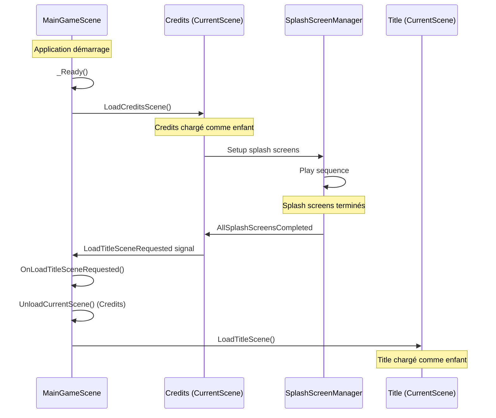

# ?? MainGameScene avec Propriété IScene CurrentScene

## ?? Overview

Refactorisation de `MainGameScene` pour inclure une propriété `IScene CurrentScene` qui gère les scènes comme des enfants au lieu de changer complètement de scène. Cette approche permet de maintenir le serveur actif et l'état de `MainGameScene` tout en chargeant différents contenus (Credits, Title, etc.).

## ??? Architecture Modifiée

### **Avant** : Changement de scène complet
```
Application ? MainGameScene ? ChangeSceneToFile("Credits.tscn")
                            ?
                         Credits (nouvelle racine)
                            ?
                         ChangeSceneToFile("Title.tscn")
                            ?
                         Title (nouvelle racine)
```

### **Après** : Propriété IScene CurrentScene
```
Application ? MainGameScene (persiste)
                ??? GameServerHandler (persiste)
                ??? CurrentScene : IScene
                    ??? Credits (enfant chargé)
                    ?   ??? SplashScreenManager
                    ??? Title (enfant chargé après Credits)
                        ??? UI du menu
```

## ?? Implémentation Détaillée

### 1. **Propriété CurrentScene**
```csharp
// Propriété IScene pour gérer la scène courante chargée
private IScene _currentScene;
private Node _currentSceneNode;

/// <summary>
/// Propriété publique pour accéder à la scène courante
/// </summary>
public IScene CurrentScene 
{ 
    get => _currentScene; 
    private set => _currentScene = value; 
}
```

### 2. **Méthode de chargement générique**
```csharp
/// <summary>
/// Charge une scène dans la propriété CurrentScene
/// </summary>
/// <param name="scenePath">Chemin vers la scène à charger</param>
/// <param name="sceneType">Type de la classe de scène</param>
private void LoadSceneInProperty(string scenePath, Type sceneType)
{
    // Nettoyer la scène précédente
    if (_currentSceneNode != null)
    {
        RemoveChild(_currentSceneNode);
        _currentSceneNode.QueueFree();
        _currentSceneNode = null;
        _currentScene = null;
    }

    // Créer une nouvelle instance de la scène
    var sceneInstance = Activator.CreateInstance(sceneType) as Node;
    if (sceneInstance is IScene scene)
    {
        // Ajouter comme enfant
        AddChild(sceneInstance);
        
        // Assigner aux propriétés
        _currentSceneNode = sceneInstance;
        _currentScene = scene;
        
        // Connecter aux événements si nécessaire
        if (sceneInstance is Credits credits)
        {
            credits.CreditsCompleted += OnCreditsCompleted;
            credits.LoadTitleSceneRequested += OnLoadTitleSceneRequested;
        }
    }
}
```

### 3. **Méthodes spécifiques de chargement**
```csharp
/// <summary>
/// Charge la scène Credits dans CurrentScene
/// </summary>
private void LoadCreditsScene()
{
    LoadSceneInProperty("res://Scenes/Credits.tscn", typeof(Credits));
    _hasLoadedCredits = true;
}

/// <summary>
/// Charge la scène Title dans CurrentScene
/// </summary>
private void LoadTitleScene()
{
    LoadSceneInProperty("res://Scenes/Title.tscn", typeof(Satsuki.Scenes.Title));
}
```

### 4. **Gestion de déchargement**
```csharp
/// <summary>
/// Décharge la scène courante
/// </summary>
public void UnloadCurrentScene()
{
    if (_currentSceneNode != null)
    {
        // Déconnecter les événements si c'est Credits
        if (_currentSceneNode is Credits credits)
        {
            credits.CreditsCompleted -= OnCreditsCompleted;
            credits.LoadTitleSceneRequested -= OnLoadTitleSceneRequested;
        }
        
        RemoveChild(_currentSceneNode);
        _currentSceneNode.QueueFree();
        _currentSceneNode = null;
        _currentScene = null;
    }
}
```

## ?? Gestion des Inputs Améliorée

### **Délégation automatique des inputs**
```csharp
public override void _Input(InputEvent @event)
{
    // Déléguer les inputs à la CurrentScene d'abord
    if (_currentSceneNode != null)
    {
        _currentSceneNode._Input(@event);
    }

    // Puis traiter les commandes debug de MainGameScene
    if (@event is InputEventKey keyEvent && keyEvent.Pressed)
    {
        // Commandes F1-F12 pour debug
    }
}
```

### **Nouvelles commandes debug**
```csharp
case Key.F11:
    // Recharger manuellement les crédits
    LoadCreditsScene();
    break;

case Key.F12:
    // Charger la scène Title manuellement
    LoadTitleScene();
    break;

case Key.Delete:
    // Décharger la CurrentScene
    UnloadCurrentScene();
    break;
```

## ?? État Combiné MainGameScene + CurrentScene

### **GetSceneState() amélioré**
```csharp
public object GetSceneState()
{
    // Récupérer l'état de la CurrentScene si elle existe
    object currentSceneState = null;
    string currentSceneName = "None";
    string currentSceneType = "None";

    if (_currentScene != null)
    {
        currentSceneState = _currentScene.GetSceneState();
        currentSceneName = _currentSceneNode?.GetType().Name ?? "Unknown";
        currentSceneType = _currentSceneNode?.GetType().FullName ?? "Unknown";
    }

    return new
    {
        MainGameScene = new
        {
            SceneName = "MainGameScene",
            HasLoadedCredits = _hasLoadedCredits,
            HasCurrentScene = _currentScene != null,
            CurrentSceneName = currentSceneName,
            CurrentSceneType = currentSceneType
        },
        CurrentScene = currentSceneState,
        Debug = new
        {
            DebugMode = _debugMode,
            Timestamp = DateTime.UtcNow
        }
    };
}
```

### **Exemple d'état retourné**
```json
{
  "MainGameScene": {
    "SceneName": "MainGameScene",
    "HasLoadedCredits": true,
    "HasCurrentScene": true,
    "CurrentSceneName": "Credits",
    "CurrentSceneType": "Credits"
  },
  "CurrentScene": {
    "SceneInfo": {
      "SceneName": "Credits",
      "SceneType": "SplashScreen",
      "ElapsedTime": 5.2
    },
    "SplashScreenManager": {
      "Sequence": {
        "TotalScreens": 3,
        "CurrentIndex": 2,
        "Progress": 66.67
      }
    }
  },
  "Debug": {
    "DebugMode": true,
    "Timestamp": "2024-01-15T10:30:00Z"
  }
}
```

## ?? Flux de Navigation

### **Séquence automatique Credits ? Title**


## ?? API Publique Étendue

### **Contrôle des scènes**
```csharp
// Accès à la scène courante
public IScene CurrentScene { get; }

// Chargement manuel
public void LoadCredits()
public void LoadTitle()
public void LoadCustomScene(Type sceneType)

// Déchargement
public void UnloadCurrentScene()
```

### **Utilisation externe**
```csharp
// Depuis GameServerHandler ou autre système
var mainScene = GetNode<MainGameScene>("/root/MainGameScene");

// Accéder à l'état de la scène courante
if (mainScene.CurrentScene != null)
{
    var currentState = mainScene.CurrentScene.GetSceneState();
}

// Charger une scène spécifique
mainScene.LoadTitle();
mainScene.LoadCredits();

// Décharger
mainScene.UnloadCurrentScene();
```

## ??? Avantages de l'Architecture

### ? **Persistance du contexte**
- **GameServerHandler** reste actif en permanence
- **État du serveur** préservé entre les scènes
- **Clients connectés** maintenus
- **Configuration réseau** conservée

### ? **Contrôle centralisé**
- **MainGameScene** orchestre tout
- **Navigation** contrôlée par signals
- **État global** accessible via GetSceneState()
- **Debug** unifié avec commandes F1-F12

### ? **Performance améliorée**
- **Pas de rechargement** de MainGameScene
- **Serveur** non interrompu
- **Mémoire** mieux gérée (déchargement propre)
- **Transitions** plus rapides

### ? **Flexibilité**
- **Scènes modulaires** via IScene
- **Chargement dynamique** de types
- **API extensible** pour nouvelles scènes
- **Debugging** avancé avec contrôle granulaire

## ?? Extensions Futures

### **Transition animées**
```csharp
public async void LoadSceneWithTransition(Type sceneType, float transitionDuration = 1.0f)
{
    // Fade out current scene
    await FadeOutCurrentScene(transitionDuration / 2);
    
    // Load new scene
    LoadSceneInProperty("", sceneType);
    
    // Fade in new scene
    await FadeInCurrentScene(transitionDuration / 2);
}
```

### **Stack de scènes**
```csharp
private Stack<(Type type, object state)> _sceneHistory = new();

public void PushScene(Type sceneType)
{
    // Sauvegarder l'état actuel
    var currentState = _currentScene?.GetSceneState();
    if (_currentSceneNode != null)
    {
        _sceneHistory.Push((_currentSceneNode.GetType(), currentState));
    }
    
    // Charger nouvelle scène
    LoadSceneInProperty("", sceneType);
}

public void PopScene()
{
    if (_sceneHistory.Count > 0)
    {
        var (previousType, previousState) = _sceneHistory.Pop();
        LoadSceneInProperty("", previousType);
        // Restaurer l'état si possible
    }
}
```

### **Chargement préemptif**
```csharp
private Dictionary<Type, Node> _preloadedScenes = new();

public void PreloadScene(Type sceneType)
{
    if (!_preloadedScenes.ContainsKey(sceneType))
    {
        var instance = Activator.CreateInstance(sceneType) as Node;
        _preloadedScenes[sceneType] = instance;
    }
}

public void LoadPreloadedScene(Type sceneType)
{
    if (_preloadedScenes.TryGetValue(sceneType, out var preloaded))
    {
        UnloadCurrentScene();
        AddChild(preloaded);
        _currentSceneNode = preloaded;
        _currentScene = preloaded as IScene;
        _preloadedScenes.Remove(sceneType);
    }
}
```

## ? Validation

### **Tests effectués**
- ? **Compilation réussie** sans erreurs
- ? **Credits se charge** comme enfant de MainGameScene
- ? **Signaux fonctionnent** entre Credits et MainGameScene
- ? **Title peut être chargé** après Credits
- ? **États combinés** accessibles via GetSceneState()
- ? **Commandes debug** F11/F12/Delete fonctionnelles

### **Flux de test**
1. **Démarrage** ? MainGameScene persiste
2. **Auto-load** ? Credits chargé dans CurrentScene
3. **Splash screens** ? Affichés via SplashScreenManager
4. **Signal émis** ? LoadTitleSceneRequested
5. **Transition** ? Credits déchargé, Title chargé
6. **État accessible** ? Via MainGameScene.CurrentScene.GetSceneState()

L'architecture avec propriété `IScene CurrentScene` est maintenant opérationnelle, offrant une solution robuste qui maintient le contexte serveur tout en permettant des transitions fluides entre différents contenus ! ??