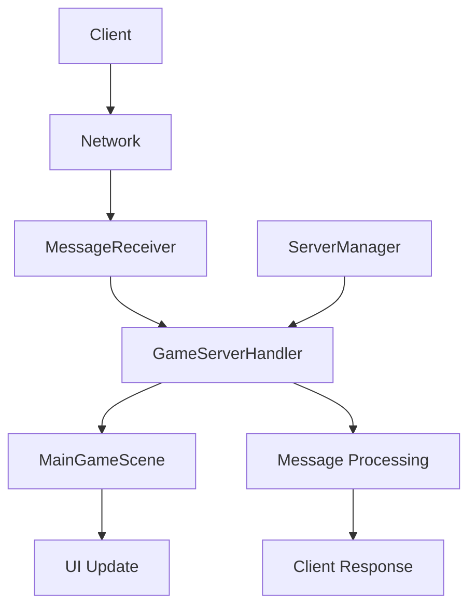

# ?? Architecture Serveur Refactorisée - Satsuki

## ?? Vue d'ensemble

Cette refactorisation sépare clairement les responsabilités entre la gestion de l'interface utilisateur et la gestion du serveur dans le projet Satsuki.

## ??? Nouvelle Architecture

### ?? Structure des Classes

```
MainGameScene.cs (UI & Scene Management)
??? GameServerHandler.cs (Server Logic)
?   ??? MessageReceiver
?   ??? MessageCrypto
?   ??? Network
??? ServerManager.cs (Server Lifecycle)
```

## ?? Séparation des Responsabilités

### ?? MainGameScene.cs
**Responsabilité** : Gestion de l'interface utilisateur et de la logique de scène

**Fonctionnalités** :
- ? Gestion des événements UI
- ? Affichage des notifications réseau
- ? Mise à jour des indicateurs de statut
- ? Gestion des changements de scène
- ? Implémentation de `IScene`
- ? Délégation des commandes serveur

**Ce qui a été déplacé** :
- ? Traitement des messages réseau
- ? Gestion du cryptage
- ? Communication avec les clients
- ? Statistiques serveur

### ?? GameServerHandler.cs
**Responsabilité** : Gestion complète du serveur de jeu

**Fonctionnalités** :
- ? Traitement des messages entrants
- ? Gestion du système de cryptage
- ? Communication avec les clients
- ? Statistiques et debug serveur
- ? Gestion des types de messages
- ? Broadcasting de messages

**Événements émis** :
- `ServerStarted`
- `ServerStopped` 
- `ServerError`
- `ClientConnected`
- `ClientDisconnected`
- `MessageReceived`

### ?? ServerManager.cs
**Responsabilité** : Gestion du cycle de vie du serveur

**Fonctionnalités** :
- ? Démarrage/arrêt du serveur
- ? Authentification des clients BACKEND
- ? Gestion des types de clients
- ? AutoLoad Godot
- ? Interface avec GameServerHandler

## ?? Flux de Communication



## ?? API Publique

### MainGameScene

```csharp
// Accès au gestionnaire serveur
GameServerHandler GetServerHandler()

// Communication simplifiée
void SendMessageToClient(string clientId, string message, bool encrypt = true)
void BroadcastMessage(string message, bool encrypt = true)
int GetConnectedClientCount()

// Gestion des scènes
object GetSceneState()
object GetGameSceneState()
void ChangeScene(string scenePath)
```

### GameServerHandler

```csharp
// Communication réseau
void SendMessageToClient(string clientId, string message, bool encrypt = true)
void BroadcastToAllClients(string message, bool encrypt = true)
void BroadcastToOtherClients(string senderClientId, string message, bool encrypt = true)
void DisconnectClient(string clientId)

// Gestion du cryptage
void ToggleEncryption()
void GenerateNewEncryptionKey()

// Traitement des messages
void ProcessMessagesHighFrequency()
void ProcessLimitedMessages(int maxMessages = 10)

// Informations
object GetServerState()
object GetCompleteGameState()
int GetConnectedClientCount()

// Debug
void ToggleDebugMode()
void ListConnectedClients()
```

## ?? Utilisation

### Depuis MainGameScene

```csharp
// Obtenir le gestionnaire serveur
var serverHandler = GetServerHandler();

// Envoyer un message
serverHandler.SendMessageToClient("Client_1", "Hello!", encrypt: true);

// Obtenir les statistiques
var state = serverHandler.GetCompleteGameState();

// API simplifiée
SendMessageToClient("Client_1", "Hello!");
BroadcastMessage("Server announcement!");
```

### Depuis d'autres classes

```csharp
// Récupérer MainGameScene
var mainGameScene = GetNode<MainGameScene>("/root/MainGameScene");

// Accéder au serveur
var serverHandler = mainGameScene.GetServerHandler();

// Utiliser les fonctionnalités serveur
serverHandler.BroadcastToAllClients("Global message");
```

## ?? Touches de Debug (F1-F10)

| Touche | Action | Classe responsable |
|--------|--------|-------------------|
| F1 | Test broadcast crypté | GameServerHandler |
| F2 | Afficher statistiques | GameServerHandler |
| F3 | Lister clients | GameServerHandler |
| F4 | Toggle debug mode | MainGameScene + GameServerHandler |
| F5 | Message chat serveur | GameServerHandler |
| F6 | Traitement haute fréquence | GameServerHandler |
| F7 | Traitement limité (5 msg) | GameServerHandler |
| F8 | Toggle cryptage | GameServerHandler |
| F9 | Nouvelle clé crypto | GameServerHandler |
| F10 | État complet du jeu | GameServerHandler |

## ?? Configuration

### AutoLoad (dans Godot)

```
ServerManager -> /root/ServerManager (Systems/ServerManager.cs)
```

### Initialisation automatique

1. `MainGameScene` se charge
2. Crée et ajoute `GameServerHandler` en tant qu'enfant
3. `GameServerHandler` configure `ServerManager`
4. Le serveur démarre automatiquement

## ?? Avantages de cette Architecture

### ? Séparation des responsabilités
- UI et logique métier séparées
- Code plus maintenable
- Tests plus faciles

### ? Réutilisabilité
- `GameServerHandler` peut être utilisé dans d'autres scènes
- API claire et documentée
- Modularité améliorée

### ? Extensibilité
- Facile d'ajouter de nouveaux types de messages
- Gestion d'événements flexible
- Architecture orientée événements

### ? Debugging amélioré
- Logs séparés par responsabilité
- Statistiques centralisées
- Debug commands organisées

## ?? Points d'attention

### Migration du code existant
- Vérifier les appels directs à `MessageReceiver` ou `Network`
- Utiliser l'API de `GameServerHandler` ou `MainGameScene`
- Mettre à jour les tests unitaires

### Performance
- Les événements ajoutent une légère surcharge
- Les appels sont maintenant asynchrones
- Surveiller la mémoire avec les événements

### Dépendances
- `GameServerHandler` dépend de `MainGameScene` pour l'état
- `ServerManager` dépend de `GameServerHandler`
- Cycle de vie géré automatiquement

## ?? Évolutions futures

### Possibilités d'extension
- Plugin system pour les types de messages
- Système de middleware pour le traitement
- Interface web d'administration
- Monitoring en temps réel

### Optimisations prévues
- Pool d'objets pour les messages
- Compression des données
- Load balancing
- Clustering multi-serveurs