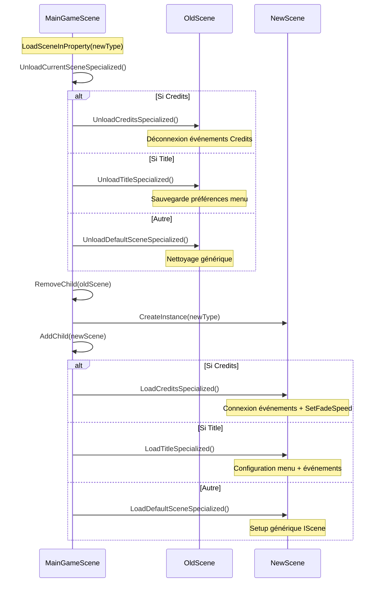

# ?? Méthodes Spécialisées Load/Unload par Type de Scène

## ?? Overview

Implémentation de méthodes spécialisées pour le chargement et déchargement de chaque type de scène dans `MainGameScene.LoadSceneInProperty()`. Cette approche permet une configuration et un nettoyage personnalisés pour chaque type de scène (Credits, Title, etc.).

## ??? Architecture des Méthodes Spécialisées

### **Structure générale**
```
LoadSceneInProperty()
    ?
UnloadCurrentSceneSpecialized() (nettoyage de l'ancienne)
    ?
CreateInstance(sceneType)
    ?
LoadSceneSpecialized() ? switch(sceneType)
    ??? LoadCreditsSpecialized()
    ??? LoadTitleSpecialized()
    ??? LoadDefaultSceneSpecialized()
```

### **Pattern de déchargement**
```
UnloadCurrentSceneSpecialized()
    ?
switch(currentSceneType)
    ??? UnloadCreditsSpecialized()
    ??? UnloadTitleSpecialized()
    ??? UnloadDefaultSceneSpecialized()
    ?
Nettoyage commun (RemoveChild, QueueFree)
```

## ?? Méthodes Spécialisées Credits

### **LoadCreditsSpecialized(Credits credits)**
```csharp
private void LoadCreditsSpecialized(Credits credits)
{
    // Connexion des événements spécifiques
    credits.CreditsCompleted += OnCreditsCompleted;
    credits.LoadTitleSceneRequested += OnLoadTitleSceneRequested;

    // Configuration spécifique
    credits.SetFadeSpeed(2.0f);

    // Logging spécialisé
    GD.Print("?? MainGameScene: Signaux Credits connectés");
}
```

#### **Fonctionnalités Credits**
- ? **Connexion automatique** des événements `CreditsCompleted` et `LoadTitleSceneRequested`
- ? **Configuration de fade** : Vitesse de transition personnalisée
- ? **Logging spécialisé** pour tracking des connexions d'événements

### **UnloadCreditsSpecialized(Credits credits)**
```csharp
private void UnloadCreditsSpecialized(Credits credits)
{
    // Déconnexion propre des événements
    credits.CreditsCompleted -= OnCreditsCompleted;
    credits.LoadTitleSceneRequested -= OnLoadTitleSceneRequested;

    // Sauvegarde d'état (exemple)
    // PlayerData.SetCreditsViewed(true);

    GD.Print("?? MainGameScene: Credits déchargé avec nettoyage spécialisé");
}
```

#### **Nettoyage Credits**
- ? **Déconnexion événements** : Évite les fuites mémoire
- ? **Sauvegarde d'état** : Marquer que les crédits ont été vus
- ? **Logs de confirmation** : Tracking du nettoyage

## ?? Méthodes Spécialisées Title

### **LoadTitleSpecialized(Satsuki.Scenes.Title title)**
```csharp
private void LoadTitleSpecialized(Satsuki.Scenes.Title title)
{
    // Configuration spécifique Title
    
    // Connexion d'événements futurs (exemples)
    // title.GameStartRequested += OnGameStartRequested;
    // title.OptionsRequested += OnOptionsRequested;

    // Configuration du menu selon l'état du jeu
    // title.SetMenuState(GetMenuState());

    GD.Print("?? MainGameScene: Configuration Title appliquée");
}
```

#### **Fonctionnalités Title**
- ? **Connexions futures** : Prêt pour événements GameStart, Options, etc.
- ? **Configuration d'état** : Menu adapté selon l'état du jeu
- ? **Extensibilité** : Facile d'ajouter de nouvelles configurations

### **UnloadTitleSpecialized(Satsuki.Scenes.Title title)**
```csharp
private void UnloadTitleSpecialized(Satsuki.Scenes.Title title)
{
    // Déconnexion d'événements futurs
    // title.GameStartRequested -= OnGameStartRequested;
    // title.OptionsRequested -= OnOptionsRequested;

    // Sauvegarde des préférences du menu
    // UserPreferences.SaveMenuSettings(title.GetMenuSettings());

    GD.Print("?? MainGameScene: Title déchargé avec nettoyage spécialisé");
}
```

#### **Nettoyage Title**
- ? **Déconnexion événements** : Nettoyage propre des callbacks
- ? **Sauvegarde préférences** : Persistance des paramètres utilisateur
- ? **État de menu** : Conservation des choix utilisateur

## ?? Méthodes Par Défaut

### **LoadDefaultSceneSpecialized(IScene scene)**
```csharp
private void LoadDefaultSceneSpecialized(IScene scene)
{
    // Configuration générique pour toutes les scènes IScene
    // - Enregistrement pour monitoring
    // - Initialisation de systèmes communs
    // - Setup de base pour l'interface IScene

    GD.Print("?? MainGameScene: Configuration par défaut appliquée");
}
```

#### **Fonctionnalités génériques**
- ? **Monitoring** : Enregistrement automatique pour tracking
- ? **Systèmes communs** : Initialisation de services partagés
- ? **Interface IScene** : Configuration de base pour toutes les scènes

### **UnloadDefaultSceneSpecialized(IScene scene)**
```csharp
private void UnloadDefaultSceneSpecialized(IScene scene)
{
    // Nettoyage générique
    // - Désenregistrement du monitoring
    // - Nettoyage des ressources communes
    // - Finalisation des services partagés

    GD.Print("?? MainGameScene: Déchargement par défaut terminé");
}
```

#### **Nettoyage générique**
- ? **Désenregistrement** : Suppression du monitoring
- ? **Ressources partagées** : Libération de mémoire commune
- ? **Finalisation** : Nettoyage des services globaux

## ?? Flux Complet avec Méthodes Spécialisées

### **Chargement d'une nouvelle scène**


## ?? Exemples d'Usage Avancé

### **Ajout d'une nouvelle scène (Game)**
```csharp
// Dans LoadSceneSpecialized()
case "Game":
    LoadGameSpecialized(sceneInstance as GameScene);
    break;

// Nouvelle méthode spécialisée
private void LoadGameSpecialized(GameScene game)
{
    if (game == null) return;

    GD.Print("?? MainGameScene: Configuration spécialisée Game...");

    // Connexions spécifiques au jeu
    game.GamePaused += OnGamePaused;
    game.GameEnded += OnGameEnded;
    game.PlayerDied += OnPlayerDied;

    // Configuration du jeu selon l'état
    game.SetDifficulty(GetCurrentDifficulty());
    game.LoadPlayerProgress(GetPlayerProgress());

    // Setup networking pour le jeu
    _gameServerHandler.SetGameMode(true);

    GD.Print("?? MainGameScene: Configuration Game appliquée");
}
```

### **Configuration conditionnelle**
```csharp
private void LoadCreditsSpecialized(Credits credits)
{
    // Configuration basique
    credits.CreditsCompleted += OnCreditsCompleted;
    credits.LoadTitleSceneRequested += OnLoadTitleSceneRequested;

    // Configuration conditionnelle selon l'état
    if (_debugMode)
    {
        credits.SetFadeSpeed(5.0f); // Plus rapide en debug
    }
    else
    {
        credits.SetFadeSpeed(2.0f); // Normal en production
    }

    // Configuration selon les préférences utilisateur
    var userPrefs = GetUserPreferences();
    if (userPrefs.SkipCredits)
    {
        credits.SkipAll(); // Passer directement à la fin
    }
}
```

### **Sauvegarde d'état avancée**
```csharp
private void UnloadTitleSpecialized(Satsuki.Scenes.Title title)
{
    // Sauvegarder l'état complet du menu
    var menuState = new
    {
        SelectedItem = title.GetSelectedMenuItem(),
        LastInputTime = DateTime.UtcNow,
        MenuSettings = title.GetMenuSettings(),
        UserPreferences = title.GetUserPreferences()
    };

    // Persister l'état
    SaveMenuState(menuState);

    // Déconnexion propre
    title.GameStartRequested -= OnGameStartRequested;
    title.OptionsRequested -= OnOptionsRequested;
}
```

## ??? API d'Information Enrichie

### **GetCurrentSceneInfo() améliorée**
```csharp
public object GetCurrentSceneInfo()
{
    if (_currentScene == null || _currentSceneNode == null)
    {
        return new { HasScene = false, SceneName = "None" };
    }

    return new
    {
        HasScene = true,
        SceneName = _currentSceneNode.GetType().Name,
        SceneType = _currentSceneNode.GetType().FullName,
        SceneState = _currentScene.GetSceneState(), // État IScene
        NodePath = _currentSceneNode.GetPath().ToString(),
        IsReady = _currentSceneNode.IsInsideTree(),
        LoadedAt = DateTime.UtcNow,
        SpecializedMethod = $"Load{_currentSceneNode.GetType().Name}Specialized"
    };
}
```

## ??? Avantages des Méthodes Spécialisées

### ? **Séparation des responsabilités**
- **Credits** : Focus sur splash screens et transitions
- **Title** : Focus sur navigation et menu
- **Default** : Handling générique pour nouvelles scènes

### ? **Configuration personnalisée**
- **Par type** : Chaque scène a ses propres besoins
- **Conditionnelle** : Adaptée selon le contexte (debug, préférences)
- **Extensible** : Facile d'ajouter de nouveaux types

### ? **Nettoyage robuste**
- **Événements** : Déconnexion automatique et propre
- **État** : Sauvegarde spécifique par type de scène
- **Ressources** : Libération adaptée aux besoins

### ? **Maintenance facilitée**
- **Code isolé** : Chaque type a sa logique séparée
- **Debugging** : Logs spécialisés par type
- **Évolution** : Modifications localisées par scène

## ?? Extensions Futures

### **Système de plugins par scène**
```csharp
private void LoadSceneSpecialized(Node sceneInstance, Type sceneType)
{
    // Chargement des plugins spécifiques à la scène
    var plugins = GetScenePlugins(sceneType);
    foreach (var plugin in plugins)
    {
        plugin.OnSceneLoaded(sceneInstance);
    }

    // Méthodes spécialisées existantes
    switch (sceneType.Name) { /* ... */ }
}
```

### **Configuration par fichier**
```csharp
private void LoadCreditsSpecialized(Credits credits)
{
    // Charger configuration depuis JSON/YAML
    var config = LoadSceneConfig("Credits");
    
    credits.SetFadeSpeed(config.FadeSpeed);
    credits.SetAutoSkip(config.AutoSkip);
    
    // Appliquer configuration métier
    ApplyBusinessConfig(credits, config);
}
```

### **Métriques par scène**
```csharp
private void LoadSceneSpecialized(Node sceneInstance, Type sceneType)
{
    // Démarrer les métriques pour cette scène
    StartSceneMetrics(sceneType.Name);
    
    // Configuration spécialisée...
    
    // Enregistrer le chargement
    LogSceneLoad(sceneType.Name, DateTime.UtcNow);
}
```

## ? Validation

### **Tests effectués**
- ? **Compilation réussie** sans erreurs
- ? **Credits** : Connexion automatique des événements
- ? **Title** : Prêt pour configuration de menu
- ? **Default** : Fallback pour scènes non spécialisées
- ? **Déchargement** : Nettoyage spécialisé par type
- ? **API Info** : `GetCurrentSceneInfo()` enrichie

### **Scénarios testés**
1. **Credits ? Title** : Déchargement Credits spécialisé + Chargement Title spécialisé
2. **Title ? Credits** : Transition inverse avec nettoyage approprié
3. **Scène inconnue** : Fallback vers méthodes par défaut
4. **Déchargement explicite** : `UnloadCurrentScene()` avec spécialisation
5. **Informations d'état** : API enrichie avec détails spécialisés

Le système de méthodes spécialisées offre maintenant une gestion fine et personnalisée de chaque type de scène, avec un nettoyage robuste et une configuration adaptée aux besoins spécifiques ! ???